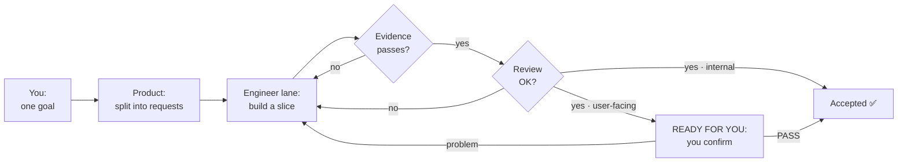

<p align="center">
  
</p>

<p align="center">
  <strong>Loop Crew</strong> — a small crew of Codex agents with a built-in review loop, run entirely inside the Codex app (no CLI). It tells you the one moment a human is needed.<br>
  <sub>package: <code>codex-agent-loop-orchestrator</code></sub>
</p>

<p align="center">
  
  
  
  
</p>

English | [简体中文](README.zh-CN.md)

<p align="center">
  <a href="#install-2-minutes">Install</a>
  |
  <a href="#your-first-run">First run</a>
  |
  <a href="#what-a-run-looks-like">Visual tour</a>
  |
  <a href="#the-core-ideas-in-plain-words">Core ideas</a>
  |
  <a href="#does-it-actually-help">Does it help?</a>
  |
  <a href="#grounded-in-prior-work">Grounded in</a>
</p>

## What it is

You describe a goal. The skill splits the work across a few specialized Codex agents ("lanes"), keeps all the
project state in files instead of disposable chat history, makes each agent **prove** its work passed before it
counts, and has a separate agent review it. A local dashboard watches all of it and raises a banner the one
time a human is needed.

**Built for the Codex app, not the CLI.** The terminal can already spawn agents; the hard part was doing it
*inside the app*. Under the hood the skill calls the Codex app's own `create_thread` tool to open each agent as
a real conversation and auto-seed it with its role, write scope, and — by default — the **highest model tier
your host offers, at `xhigh` reasoning** (quality-first; you can dial any single lane down by hand). The whole
team assembles itself inside the app. You never leave it: no terminal, no logs to read, no commands to memorize.

<p align="center">
  
</p>

> The image above is a mock of a generic Codex-style desktop host (no OpenAI/ChatGPT branding, account
> identity, or real data); the HTML source is [`assets/codex-app-session.html`](assets/codex-app-session.html).

## Install (2 minutes)

Open a fresh folder, start one Codex conversation in it, and paste this:

```text
Install the Codex skill from https://github.com/hanco1/codex-app-loop-crew into my personal Codex skills directory. Clone the repository into this fresh folder, run the repository's installer for my operating system (install.ps1 on Windows or install.sh on macOS/Linux), verify that codex-agent-loop-orchestrator is present under my Codex skills directory, and tell me to open a new Codex session so the skill can be rediscovered. Do not modify or push the cloned repository.
```

Then open a new Codex session so the skill is rediscovered. That's it — no CLI steps of your own.

<details>
<summary>Prefer to run the installer yourself, or use the plugin marketplace</summary>

Both scripts locate `skills/codex-agent-loop-orchestrator` relative to the repo root and refresh the installed copy.

Windows PowerShell:

```powershell
git clone https://github.com/hanco1/codex-app-loop-crew.git
cd .\codex-app-loop-crew
.\install.ps1
```

If script execution is blocked: `powershell -ExecutionPolicy Bypass -File .\install.ps1`

macOS / Linux:

```bash
git clone https://github.com/hanco1/codex-app-loop-crew.git
cd codex-app-loop-crew
chmod +x install.sh
./install.sh
```

Default install path: `%USERPROFILE%\.codex\skills\...` (Windows) or `~/.codex/skills/...` (macOS/Linux).
Override with `-SkillsDir <path>` (PowerShell) or `CODEX_SKILLS_DIR=<path>` (bash). Open a new Codex session afterward.

Plugin marketplace:

```bash
codex plugin marketplace add hanco1/codex-app-loop-crew
codex plugin add codex-agent-loop-orchestrator@codex-app-loop-crew
```

</details>

## Your first run

In your project folder, paste this into one Codex conversation:

```text
Use $codex-agent-loop-orchestrator for this project.

Build <one sentence: the objective, a concrete output, and a checkable done condition>.

Real data stays local. Never upload, quote, log, commit, or copy raw private data into loop files; use only an approved redacted sample or a field-shape description.

Ask one intake question at a time with your recommended answer, and stop once the objective and done condition are checkable. Then propose the smallest useful lane team and wait for my approval. After the First Move, tell me the dashboard URL.
```

The skill first checks the task size. **If the job fits one focused session, expect it to recommend a plain
Codex session instead of a loop** — this machinery is overkill for small work (see [When not to use it](#when-not-to-use-it)).

## What a run looks like

You state a goal once; the agents work; the dashboard tells you the single moment you're needed.

<details>
<summary><strong>▸ Show the flow</strong></summary>



</details>

The dashboard screenshots below are the real local viewer (light theme) over an archived run; public copies
redact local paths, account identity, and conversation IDs.

**Progress — watch slices land.** Checkpoints tick off as each request is accepted, so you know how far along
you are without reading any chat.


**Lane card — what one agent is doing.** Its job, its latest result, its last check-in (a heartbeat), and its
model tier.


**"Ready for you" — the one moment you're needed.** The banner names the exact conversation to open. Until you
see it, you can leave the agents alone.


<details>
<summary>Full-page dashboard overview</summary>


</details>

## The core ideas (in plain words)

Six ideas do all the work.

1. **A "lane" is one agent's standing job.** Instead of one AI doing everything, each *kind* of work gets its
   own worker (backend, frontend, reviewer), and each owns its files so they don't overwrite each other.
2. **Work has a status you can always read.** Every task moves through fixed stages recorded in files, so if a
   chat is lost the next session resumes exactly where it was.
3. **"Done" has to be proven, not claimed.** An agent must run the tests and leave the results as a file. No
   readable proof means blocked — never "done with an asterisk."
4. **A different agent checks the work.** The builder never approves its own work; a separate reviewer checks
   it against the requirements, including "looks finished but is wrong."
5. **Anything you'll actually see waits for you.** For anything with a screen, passing tests isn't enough — it
   waits until you open it and say it's good. (This caught the real bugs in the comparison below.)
6. **The dashboard points you to the one thing that needs you.** You keep one dashboard open; it tells you
   when — and only when — a human is needed, and which conversation to open.

The mechanisms behind these, and their limits, are in [ADVANCED.md](ADVANCED.md) and the
[skill reference](skills/codex-agent-loop-orchestrator/).

## Does it actually help?

The same local expense-analysis app was built twice on the same model (`gpt-5.6-sol`, xhigh): once through
this loop, once as a single plain Codex session with the skill removed. Both builds are public, and both
codebases were scored by the same rubric with every serious finding independently re-verified.

| Dimension | Solo session | This loop |
|---|:---:|:---:|
| Correctness on edge input | 6 | 7 |
| Invariant enforcement depth | 6 | **8** |
| Security | 7 | **9** |
| Test quality | 7 | 7 |
| Maintainability | 8 | 8 |
| **Average** | **6.8** | **7.8** |

The loop's margin is in **security and defense-in-depth**, at roughly 8.5× the code and one-to-two orders of
magnitude more time and tokens. Honestly, **it is not magic** — the same review found real bugs in the loop's
own output too. The takeaway isn't "always use the loop," it's **match the machinery to the stakes**.

- **Full comparison:** [COMPARISON.md](COMPARISON.md)
- **Loop build** (with the full decision ledger): [expense-app-loop-built](https://github.com/hanco1/expense-app-loop-built)
- **Solo build** (with its full prompt + transcript): [expense-app-solo-session-built](https://github.com/hanco1/expense-app-solo-session-built)

## When not to use it

Use a plain Codex session for a small, low-risk task one agent can finish in one sitting — roughly under two
hours — when auditability, handoff recovery, sensitive-data gates, and real parallel lanes don't matter. The
cost is real: in one same-spec `n=1` comparison the loop took **7.2× the wall time** and **36× the total
tokens** of the direct session — and by default every lane runs on the top model at `xhigh`, so a team is
several premium sessions at once. This protocol buys traceability and independent verification; it does not
make multi-agent work free. It is also a poor fit when there's nothing meaningful to machine-check.

## Grounded in prior work

This isn't invented from scratch — it fuses two lines of work and distills a broad survey of community practice:

- **Codex "Loop Engineering"** — the app's own model for durable, long-horizon work (checkpoints, resumable
  sessions, auto-chained continuations). This skill extends it from one agent to a reviewed multi-agent team.
- **Multi-agent lane orchestration** — the app's cross-thread tools (`create_thread`, `send_message_to_thread`)
  turned into a disciplined team with disjoint write scopes and independent review.
- **A survey of ~38 community skills** ([Matt Pocock's skills collection](https://github.com/mattpocock/skills)) —
  the acceptance-criteria and review discipline here (every criterion names a *red-capable* verify command) was
  distilled from that ecosystem; **28 of 38 skills' top recommendation converged on the same idea.**
- **The memory layer** — the append-only decision log (`decisions.jsonl`, content-addressed with a
  `normalize_then_hash()` over its source docs so stale decisions are detectable) adapts ideas from
  [`Gentleman-Programming/engram`](https://github.com/Gentleman-Programming/engram) (an agent memory layer),
  the [Cartridges paper](https://arxiv.org/abs/2506.06266) (distill context into compact, auditable artifacts
  instead of replaying the raw firehose), and [`deepseek-ai/Engram`](https://github.com/deepseek-ai/Engram)
  (content-addressing, by analogy) — implemented as plain repo-readable files, not trained caches.
- **[han-design-skill-v1](https://github.com/hanco1/han-design-skill-v1)** — the companion design skill used
  for the dashboard's visual style.

## More

- **[ADVANCED.md](ADVANCED.md)** — the request lifecycle, the completion gate, the Git model (commit-as-lane,
  scope guard), daily use, and repository layout.
- **[skills/codex-agent-loop-orchestrator/](skills/codex-agent-loop-orchestrator/)** — the skill itself:
  `SKILL.md` and its references.

## License

MIT. See [LICENSE](LICENSE).
