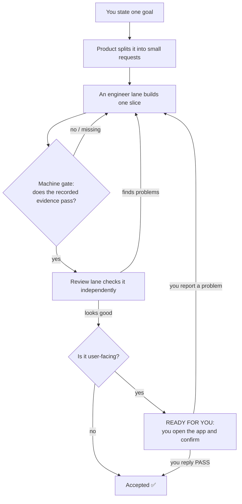

<p align="center">
  <strong>Codex Agent Loop Orchestrator</strong>
</p>

<p align="center">
  Durable, review-gated multi-agent Codex work that survives context loss—and tells you exactly when a human is needed.
</p>

<p align="center">
  <strong>Built for the Codex app, not the terminal.</strong><br>
  You drive the whole thing by chatting with one agent and watching a local dashboard—so multi-agent development stays approachable even if you're new to it or would rather never touch a CLI.
</p>

<p align="center">
  
  
  
  
</p>

English | [简体中文](README.zh-CN.md)

<p align="center">
  <a href="#quick-start">Quick Start</a>
  |
  <a href="#does-it-actually-help-a-public-ab-build">Does it help?</a>
  |
  <a href="#what-a-run-looks-like-visual-tour">Visual tour</a>
  |
  <a href="#the-core-ideas-in-plain-words">Core ideas</a>
  |
  <a href="#install">Install</a>
  |
  <a href="#git-model">Git Model</a>
  |
  <a href="#daily-use">Daily Use</a>
</p>


`codex-agent-loop-orchestrator` is a repo-local operating protocol for long-running Codex projects. It gives each ongoing agent job a named lane, keeps goals and requests in files instead of disposable chat history, requires machine-readable verification evidence, and routes every shipped slice through independent review.

It is designed for the **Codex app** (desktop or web), not for terminal power users: you install it by pasting one message into Codex, then run everything from ordinary conversations plus a local dashboard. The dashboard tells you the one moment a human is needed, so you don't have to read logs, memorize commands, or babysit a terminal.

The image above is a mock of a generic Codex-style desktop host (disclosed here rather than on the image). It contains no OpenAI or ChatGPT branding, account identity, or real project data.

## Quick Start

Start in the project folder and paste this into one Codex conversation:

```text
Use $codex-agent-loop-orchestrator for this project.

Build <one-sentence objective with a concrete output and checkable done condition>.

Real data stays local. Never upload, quote, log, commit, or copy raw private data into loop files or handoffs; use only an approved redacted sample or a field-shape description.

Ask one intake question at a time, include your recommended answer, and stop asking when the objective and Done-When are checkable.

Before creating any conversations, propose the smallest useful discipline-based lane team with pairwise-disjoint write scopes, and wait for my approval.

Do not invoke or add any other skill unless I explicitly request it.

After the First Move, report the exact dashboard URL.
```

The orchestrator should first apply its task-size gate. If the work fits one focused session, expect it to recommend a direct session instead of building a loop.

## Why This Exists

The skill conditionally solves ordinary developers' multi-agent coordination pain. It is a control and audit layer—not a promise that multiple agents become cheap, fully autonomous, or impossible to stall.

- **Know when the agents need you.** The local dashboard raises a "Ready for you" banner, moves the relevant lane to the top, and names the conversation to open.
- **Keep project state out of disposable chat history.** Goals, requests, handoffs, messages, decisions, and verification evidence live in the repository, so another session can resume from files.
- **Reduce agents stepping on the same files.** A lane is one ongoing agent job with an explicit write scope. The reference workflow requires pairwise-disjoint scopes and can reject out-of-scope commits.
- **Leave a reconstructable history.** Lane-labelled commits, saved message envelopes, an append-only transition log, and per-command evidence record what moved and why.
- **Avoid abandoned dirty work.** Every lane closes its turn with a commit; a paused loop is expected to be fully committed, and health checks surface leftover in-scope work.

These properties come from the [nine methodology invariants](skills/codex-agent-loop-orchestrator/references/methodology.md), not from the dashboard UI.

## Core Highlights

- **Machine-checked completion gate.** `SHIP_CHECK_OK` is emitted only when the completion checker can read passing exit-code evidence. Missing, malformed, or non-zero evidence fails closed. The gate validates records; it does not pretend to have run the tests itself.
- **Independent review lane.** Review checks unmet criteria, scope creep, and “looks done but is wrong” outcomes before product accepts a slice.
- **Human-QA gate for user-facing work.** Machine checks and independent review happen first. The request then stays in `REVIEWING` until a human operates the UI and confirms it.
- **Red-capable acceptance criteria.** Each criterion names a command that can fail when that requirement is violated. A check that stays green on garbage output is not evidence.
- **Invariants-first intake.** Data and multi-step systems record the rules that must never break in `goal.md`, then carry the applicable invariants into each request.
- **Bounded recovery.** Heartbeats, stalled-handoff findings, explicit fix-cycle caps, and a durable budget provide recovery paths without claiming to wake a stopped conversation automatically.
- **Runtime tier guidance.** Each lane records an abstract model tier, defaults to the host's highest available tier, and surfaces observed-tier mismatches; a human can opt a lane down.

The implementation details and their limits are documented in the skill's [Health Check](skills/codex-agent-loop-orchestrator/SKILL.md#health-check), [Verification Integrity](skills/codex-agent-loop-orchestrator/SKILL.md#verification-integrity), and [Model Tier Policy](skills/codex-agent-loop-orchestrator/SKILL.md#model-tier-policy) sections.

## When Not to Use It

Do not use this loop for a small, low-risk task that one agent can finish in one session—roughly under two hours—when auditability, handoff recovery, sensitive-data gates, and genuine parallel lanes do not matter. Use a direct Codex session instead.

The cost is real. In one same-spec, same-host `n=1` dogfood comparison, the loop took **7.2× the active wall time**, **10.6× the output tokens**, and **36× the total tokens** of the direct session. The loop's review caught correctness defects that the solo build shipped, but one comparison is not a universal benchmark. This protocol buys traceability and independent verification; it does not make multi-agent work free.

It is also a poor fit when the work has no meaningful machine-checkable acceptance surface, or when you need hands-off multi-thread execution but the host cannot create or deliver to long-lived conversations. For recurring operations, prefer using the loop once to build a reusable tool instead of keeping a standing agent team alive.

## Does it actually help? (a public A/B build)

To make the trade-off concrete, the same local expense-analysis app was built twice on the same model
(`gpt-5.6-sol`, xhigh): once through this loop, once as a single plain Codex session with the skill removed.
Both builds and the full method are public so you can read the code yourself.

Both codebases were scored by the same 5-dimension rubric, and every serious finding was re-derived by an
independent adversarial verifier before it counted:

| Dimension | Solo session | This loop |
|---|:---:|:---:|
| Correctness on edge input | 6 | 7 |
| Invariant enforcement depth | 6 | **8** |
| Security | 7 | **9** |
| Test quality | 7 | 7 |
| Maintainability | 8 | 8 |
| **Average** | **6.8** | **7.8** |

The loop's margin lands exactly where a review-and-invariants process should put it: **security and
defense-in-depth** (DB-enforced money/append-only constraints, an XSS/CSRF-airtight surface, frozen regression
matrices). It cost far more to get there — roughly 8.5× the code and one-to-two orders of magnitude more time
and tokens — and, honestly, **it is not magic**: the same review found real bugs in the loop's own output,
including a PDF path that silently dropped lines (a violation of the very "no silent data loss" invariant the
skill exists to protect). The takeaway is not "always use the loop" but **match the machinery to the stakes** —
the same task-size lesson the [When Not to Use It](#when-not-to-use-it) section states.

- **Full scored comparison:** [COMPARISON.md](COMPARISON.md)
- **Loop build** (includes the complete `docs/loop/` decision ledger): [expense-app-loop-built](https://github.com/hanco1/expense-app-loop-built)
- **Solo build** (the single-session baseline, with its full prompt + transcript): [expense-app-solo-session-built](https://github.com/hanco1/expense-app-solo-session-built)

## What a run looks like (visual tour)

You state a goal once. From there the agents do the work and the dashboard tells you the one moment you're
needed. Here is the whole flow at a glance, then what each stage looks like on screen.



The screenshots below come from the real local dashboard (light theme), served against an archived loop
state; the public copies redact local paths, account/usage identity, and conversation IDs. The dark image at
the top of this README is the mock host UI ([HTML source](assets/mock-codex-ui.html)).

**1. Progress — watch the slices land.** The tracker ticks off checkpoints as each request is accepted, so you
always know how far along the work is without reading any chat.


**2. Lane card — what one agent is doing.** Each lane is one agent's ongoing job. The card shows its
responsibility, its latest result, when it last checked in (a heartbeat), and its model tier — the state you'd
otherwise have to reconstruct from scattered chats.


**3. "Ready for you" — the one moment you're needed.** When a user-facing slice has passed the machine gate and
independent review, the dashboard raises this banner, moves that lane to the top, and names the exact
conversation to open. Until you see it, you can leave the agents alone.


<details>
<summary>Open the full-page dashboard overview</summary>


</details>

## The core ideas (in plain words)

Six ideas do all the work. Each one is stated plainly first, then with the mechanism underneath.

### 1. A "lane" is one agent's standing job

**In plain words:** instead of one AI doing everything, you give each *kind* of work its own worker — a
backend worker, a frontend worker, a reviewer — and each one owns its files so they don't overwrite each
other.

The default team is `product` (the manager), one build lane, and `review`. Add `data-eng`, `frontend`, or
another specialist only when it owns a recurring responsibility with a clear input, output, and its own
non-overlapping set of files. Lanes are job descriptions, not personalities. Product owns the ledger under
`docs/loop/**`; build lanes own separate code and test folders.

### 2. Work moves through a fixed set of stages (and can always resume)

**In plain words:** every piece of work has a status you can read at a glance, so if a chat is lost, the next
session picks up exactly where things were — nothing lives only in disposable chat history.

`requests.md` is the to-do list and the recovery index. A single `request_id` follows one task through its
whole life, even across fix rounds:

```text
PLANNED -> REQUESTED -> IMPLEMENTING -> IMPLEMENTATION_DONE
        -> REVIEWING -> FIX_REQUESTED -> ACCEPTED | BLOCKED
```

Every message between agents is saved as a file under `docs/loop/messages/<request_id>/` before it is
delivered, so the trail survives even if a conversation doesn't.

### 3. "Done" has to be proven, not claimed

**In plain words:** an agent can't just *say* it finished — it has to run the tests and leave the results as a
file. If the proof is missing or failing, the work is blocked, not "done with an asterisk."

The build lane runs each acceptance command and writes a small record with the command, its exit code, and a
timestamp. `completion_gate.py` reads those records and only then emits `SHIP_CHECK_OK`. No readable proof
means `BLOCKED` — never "accepted anyway."

### 4. A different agent checks the work

**In plain words:** the agent that built something never gets to approve its own work. A separate `review`
agent checks it against the requirements — including the sneaky "looks finished but is actually wrong" cases.

Review checks the request's declared criteria and scope, not the builder's intent. Real problems go back to the
builder under the same `request_id`; smaller notes are recorded without forcing an endless loop.

### 5. Anything you'll actually see waits for *you*

**In plain words:** for anything with a screen, passing the tests isn't enough — the work waits in review until
*you* open it and say it's good. (This is what caught the real bugs in the public comparison above.)

After machine evidence and review pass, a user-facing request stays in `REVIEWING`. Product sends you one URL
and a short "try this" note; only your explicit confirmation unlocks `ACCEPTED`.

### 6. The dashboard points you to the one thing that needs you

**In plain words:** you don't babysit the agents. You keep one dashboard open, and it tells you when — and only
when — a human is needed, and which conversation to open.

The dashboard is a read-only viewer over the repository files and a health check. It shows progress, the
current human gate, who owns what, the evidence, and Git health. You stay in the product conversation until the
banner says where to act.

## Install

### Ask Codex to install from the repository URL

Open a fresh folder, start one Codex conversation there, and paste this exact message:

```text
Install the Codex skill from https://github.com/hanco1/multi-loops-agents into my personal Codex skills directory. Clone the repository into this fresh folder, run the repository's installer for my operating system (install.ps1 on Windows or install.sh on macOS/Linux), verify that codex-agent-loop-orchestrator is present under my Codex skills directory, and tell me to open a new Codex session so the skill can be rediscovered. Do not modify or push the cloned repository.
```

### Run the installer yourself

Both scripts locate `skills/codex-agent-loop-orchestrator` relative to the repository root and replace the existing installed copy, so rerunning the installer refreshes it cleanly.

Windows PowerShell:

```powershell
git clone https://github.com/hanco1/multi-loops-agents.git
cd .\multi-loops-agents
.\install.ps1
```

If local script execution is blocked:

```powershell
powershell -ExecutionPolicy Bypass -File .\install.ps1
```

macOS or Linux:

```bash
git clone https://github.com/hanco1/multi-loops-agents.git
cd multi-loops-agents
chmod +x install.sh
./install.sh
```

Default destinations:

- Windows: `%USERPROFILE%\.codex\skills\codex-agent-loop-orchestrator`
- macOS/Linux: `~/.codex/skills/codex-agent-loop-orchestrator`

Override the destination with `-SkillsDir <path>` in PowerShell or `CODEX_SKILLS_DIR=<path>` in bash. Open a new Codex session after installation.

<details>
<summary>Optional: install as a Codex plugin marketplace entry</summary>

```bash
codex plugin marketplace add hanco1/multi-loops-agents
codex plugin add codex-agent-loop-orchestrator@multi-loops-agents
```

The plugin manifest is at [`.codex-plugin/plugin.json`](.codex-plugin/plugin.json), and the marketplace manifest is at [`.agents/plugins/marketplace.json`](.agents/plugins/marketplace.json).

</details>

## Git Model

The reference workflow uses **one shared branch with a linear, lane-labelled commit history**. That is a workflow convention, not a branch restriction enforced by the scripts.

- **Commit as the lane on every turn.** A lane finishes its slice, updates its worklog and durable request state, then commits before replying or handing off.
- **Arm the scope guard.** `install_precommit.py` installs a Git pre-commit check. With the guard active, missing `CODEX_LANE` fails closed, and staged files outside that lane's declared scope are rejected.
- **Keep write scopes disjoint.** Static lane scopes must be pairwise disjoint; dynamic file leases cover bounded exceptions. The guard acts at commit time, so it does not prevent two processes from editing the same file before a commit.
- **Pause only from a clean checkpoint.** A paused loop should be fully committed. Product checks `git status --porcelain`, and the health check reports attributable in-scope leftovers.
- **Use a private remote only as backup.** A private remote can preserve checkpoint commits and enable disaster recovery. It is not the lane message bus, and sensitive or raw data must never be committed merely because the remote is private.

Example commit identity:

```bash
CODEX_LANE=frontend git commit -m "frontend: finish request REQ-004"
```

PowerShell:

```powershell
$env:CODEX_LANE = 'frontend'
git commit -m 'frontend: finish request REQ-004'
```

### Why not one Git worktree per lane?

This reference implementation depends on all lanes seeing the same request ledger, evidence, and transition log immediately. It deliberately serializes writes when scopes conflict and does not implement branch creation, merges, rebases, or cross-worktree state reconciliation. Per-lane worktrees would add a second coordination system and can leave one lane acting on a stale ledger. If you choose worktrees, you are designing a different implementation and need an explicit merge/reconciliation protocol; the reference scope guard does not provide one.

## Daily Use

Live in the long-running **product conversation** and keep the dashboard open. Product is the durable front door for new work, acceptance changes, and final product judgment.

For a UI change, ask product in the **same conversation**:

```text
Please tighten the dashboard header spacing and improve the primary button hierarchy. Route this through the existing frontend lane and the normal review + human-QA gates.
```

Do not open an ad-hoc conversation for each change and do not ask `frontend` to bypass product. A direct lane request is routed back into the normal request lifecycle; it is never a shortcut past evidence or review. Create a replacement lane conversation only when the registered one is genuinely stale or missing, then adopt the replacement into the existing lane row.

## Repository Layout

```text
multi-loops-agents/
├── .agents/plugins/marketplace.json
├── .codex-plugin/plugin.json
├── assets/
│   ├── dashboard-overview.png
│   ├── dashboard-your-turn.png
│   ├── dashboard-lane-card.png
│   ├── dashboard-progress.png
│   ├── mock-codex-ui.html
│   └── mock-codex-ui.png
├── skills/codex-agent-loop-orchestrator/
│   ├── SKILL.md
│   ├── agents/
│   ├── references/
│   └── scripts/
├── install.ps1
├── install.sh
├── LICENSE
├── README.zh-CN.md
└── README.md
```

## License

MIT. See [LICENSE](LICENSE).
