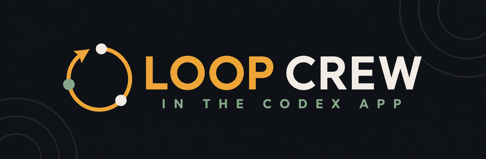
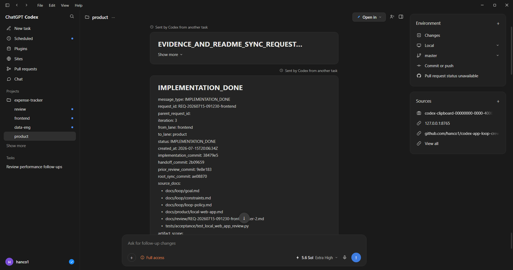
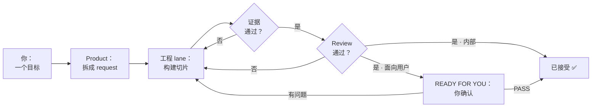
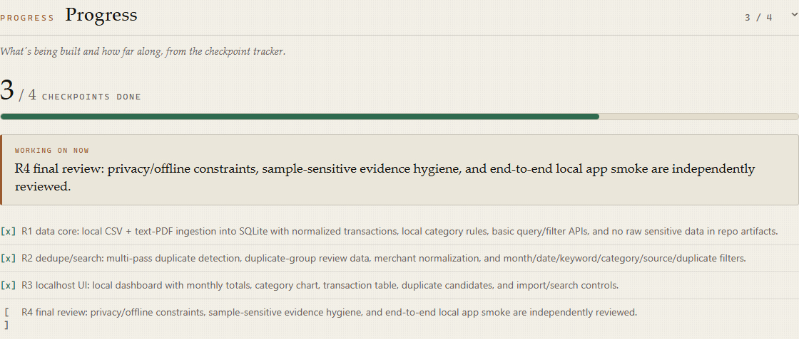
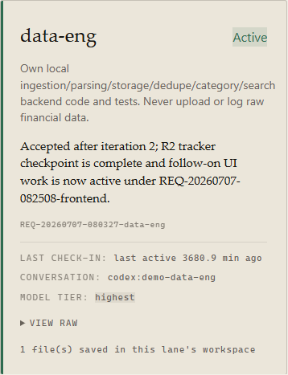
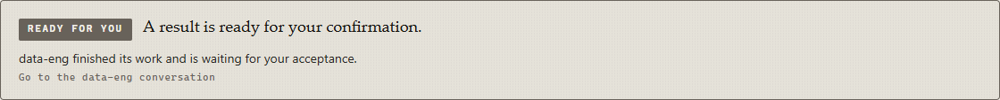
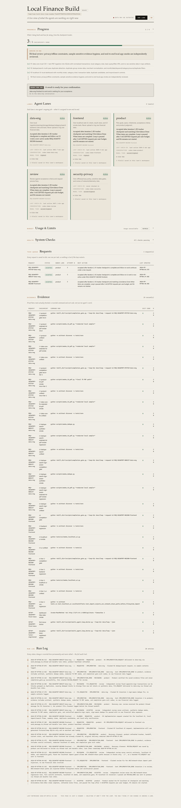

<p align="center">
  
</p>

<p align="center">
  <strong>Loop Crew</strong> —— 一小队 Codex agent，带内置的评审 loop，全程在 Codex app 里运行（不用 CLI）。它会在需要你时提醒你。<br>
  <sub>安装包名：<code>codex-agent-loop-orchestrator</code> · <a href="#更多">为什么有三个名字？</a></sub>
</p>

<p align="center">
  
  
  
  
</p>

<p align="center"><a href="README.md">English</a> | 简体中文</p>

<p align="center">
  <a href="#安装2-分钟">安装</a>
  |
  <a href="#第一次运行">第一次运行</a>
  |
  <a href="#一次运行长什么样">视觉导览</a>
  |
  <a href="#核心思路用人话讲">核心思路</a>
  |
  <a href="#它真的有用吗">它真的有用吗？</a>
  |
  <a href="#什么时候不该用">何时别用</a>
  |
  <a href="#站在前人的工作之上">理论依据</a>
</p>


## 这是什么

你描述一个目标。这个 skill 把工作拆给几个专职的 Codex agent（"lane"），把所有项目状态存进文件而不是随时会丢的聊天记录，让每个 agent 必须**证明**自己的活通过了才算数，再由另一个 agent 复查。一个本地 dashboard 盯着这一切，在需要人时亮起提示条。

**专为 Codex app 打造，不是 CLI。** 终端本来就能开 agent；难的是在 *app 里*做到。底层这个 skill 调用 Codex app 自己的 `create_thread` 工具，把每个 agent 开成一个真实对话，并自动注入它的角色、写入范围，以及默认**你的 host 能提供的最高档模型 + `xhigh` 推理**（质量优先；你可以手动把某个 lane 单独调低）—— 整队就在 app 里自己组建起来。你全程不用离开 app：没有终端、不用读日志、不用背命令。

<p align="center">
  
</p>

> 上图是 Codex 风格桌面端的模拟界面示意图；HTML 源文件见 [`assets/codex-app-session.html`](assets/codex-app-session.html)。

## 安装（2 分钟）

> 需要：Codex app（启用 skills）、`git`，以及 `PATH` 上的 Python 3 —— dashboard 和验证门槛都是小型本地 Python 脚本。

打开一个新文件夹，在里面启动一个 Codex 对话，粘贴这段话：

```text
请把 https://github.com/hanco1/codex-app-loop-crew 中的 Codex skill 安装到我的个人 Codex skills 目录。请将仓库克隆到这个新文件夹，运行适合我操作系统的仓库安装脚本（Windows 使用 install.ps1，macOS/Linux 使用 install.sh），确认 codex-agent-loop-orchestrator 已出现在我的 Codex skills 目录下，并提醒我打开新的 Codex 会话，让 Codex 重新发现这个 skill。不要修改或 push 克隆下来的仓库。
```

然后打开一个新的 Codex 会话让 skill 被重新发现。就这样 —— 你自己不用敲任何 CLI。

<details>
<summary>更愿意自己运行安装脚本，或使用插件市场</summary>

两个脚本都会相对仓库根目录定位 `skills/codex-agent-loop-orchestrator` 并刷新安装副本。

Windows PowerShell：

```powershell
git clone https://github.com/hanco1/codex-app-loop-crew.git
cd .\codex-app-loop-crew
.\install.ps1
```

如果本地脚本执行被阻止：`powershell -ExecutionPolicy Bypass -File .\install.ps1`

macOS / Linux：

```bash
git clone https://github.com/hanco1/codex-app-loop-crew.git
cd codex-app-loop-crew
chmod +x install.sh
./install.sh
```

默认安装位置：Windows `%USERPROFILE%\.codex\skills\...`，macOS/Linux `~/.codex/skills/...`。
用 `-SkillsDir <path>`（PowerShell）或 `CODEX_SKILLS_DIR=<path>`（bash）覆盖。安装后打开新的 Codex 会话。

插件市场：

```bash
codex plugin marketplace add hanco1/codex-app-loop-crew
codex plugin add codex-agent-loop-orchestrator@codex-app-loop-crew
```

</details>

## 第一次运行

> 前提：完成上面的安装，然后开一个**新的** Codex 会话（skill 在会话启动时被发现）。在你实际的项目文件夹里运行 —— 不是刚才安装用的那个文件夹。

在你的项目文件夹里，把这段话粘贴进一个 Codex 对话：

```text
请使用 $codex-agent-loop-orchestrator 管理这个项目。

完成：<一句话写明目标、具体交付物和可检查的完成条件>。

真实数据必须留在本地。不要上传、引用、记录、提交真实隐私数据，也不要把原始数据复制进 loop 文件；只允许使用我批准的脱敏样本或字段结构说明。

一次只问一个 intake 问题并附上你的推荐答案，当目标和完成条件可检查时立即停止。然后提出满足需要的最小 lane 团队并等我确认。完成 First Move 后，告诉我 dashboard 的 URL。
```

"First Move" 是 skill 的一次性初始化：写好 loop 文件、开出各 lane 对话，并**自己启动 dashboard**——一个 `127.0.0.1` 上的小型本地 web 服务——然后把 URL 发在 product 对话里。你只需要在浏览器里打开那个 URL。

skill 会先判断任务规模。**如果这活一次专注会话就能干完，它应该建议你直接用普通 Codex 会话，而不是搭 loop** —— 对小活来说这套机制是杀鸡用牛刀（见[什么时候不该用](#什么时候不该用)）。

## 一次运行长什么样

你只说一次目标；agent 们干活；dashboard 告诉你何时需要你。

<details>
<summary><strong>▸ 展开流程图</strong></summary>



</details>

下面的截图是真实的本地查看器（浅色主题）读取一份已归档的运行；公开副本已隐去本地路径、账户身份和 conversation ID。

**进度 —— 看着切片一个个落地。** 每接受一个 request 就勾掉一个 checkpoint，不用读聊天就知道进度。



**Lane 卡片 —— 某个 agent 在做什么。** 它的职责、最新结果、上次报到时间（心跳）和 model tier。



**"Ready for you" —— 轮到你了。** 提示条指明要打开哪个对话。在你看到它之前，agent 们可以自己跑。



<details>
<summary>展开完整 dashboard 总览</summary>



</details>

## 核心思路（用人话讲）

六个想法撑起了全部。

1. **一个 "lane" 就是一个 agent 的固定岗位。** 不是一个 AI 什么都干，而是每*类*工作各配一个专职 worker（后端、前端、审查），各管自己的文件互不覆盖。
2. **工作有一个随时能看懂的状态。** 每件事按固定阶段流转、记录在文件里，所以聊天丢了，下个会话也能原地接上。
3. **"完成"必须被证明，不能靠嘴说。** agent 必须跑测试并把结果留成文件。没有可读证据就是阻断，绝不"带星号完成"。
4. **换一个 agent 来查。** 建造者永远不能批准自己的活；独立的审查者对照需求来查，包括"看着完成、其实是错的"。
5. **任何你会亲眼看到的东西都要等你点头。** 只要有界面，光过测试不够 —— 得等你打开说没问题。（下面对比里的真 bug 就是这步抓到的。）
6. **dashboard 只把你指向那件需要你的事。** 你只开一个 dashboard，它告诉你什么时候（也仅在那时）需要人、该打开哪个对话。

这些背后的机制和它们的限制，见 [ADVANCED.zh-CN.md](ADVANCED.zh-CN.md) 和 [skill 参考](skills/codex-agent-loop-orchestrator/SKILL.md)。

## 它真的有用吗？

同一个本地记账分析 app 在同一个模型（`gpt-5.6-sol`，xhigh）上被构建了两次：一次走这套 loop，一次是移除 skill 的单个普通 Codex 会话。两个构建都已公开，两份代码库用同一把尺子打分，每条严重发现都由独立验证者复现。

| 维度 | 单会话 | 本 loop |
|---|:---:|:---:|
| 边缘输入正确性 | 6 | **7** |
| 不变量强制深度 | 6 | **8** |
| 安全 | 7 | **9** |
| 测试质量 | 7 | 7 |
| 可维护性 | 8 | 8 |
| **平均** | **6.8** | **7.8** |

loop 的优势在**安全和防御纵深**，代价是约 8.5 倍代码、时间和 token 高出一到两个数量级。说实话，**它不是魔法** —— 同一轮评审在 loop 自己的产出里也找出了真实 bug。结论不是"永远用 loop"，而是**让 machinery 匹配 stakes**。

- **完整对比：** [COMPARISON.md](COMPARISON.md)
- **loop 构建**（含完整决策账本）：[expense-app-loop-built](https://github.com/hanco1/expense-app-loop-built)
- **单会话构建**（含完整 prompt + 会话记录）：[expense-app-solo-session-built](https://github.com/hanco1/expense-app-solo-session-built)

## 什么时候不该用

如果任务规模小、风险低，一个 agent 一次就能干完——大致不超过两小时——而且你不需要可审计性、handoff 恢复、敏感数据门槛或真正并行的 lane，就直接用普通 Codex 会话。成本是真的。在更早的一次小规模 `n=1` dogfood 对比（一个一天规模的 MVP —— 与上面的记账 app 对比是两次独立测量）中，loop 的**活跃耗时是直接会话的 7.2 倍**、**总 token 是 36 倍**；在更大的记账 app 对比中则是 **~10 分钟 vs 数天**、token 高出一到两个数量级。而且默认每个 lane 都跑最高档模型 + `xhigh`，所以一队 agent 相当于同时开好几个顶配会话。这套协议买到的是可追溯性和独立验证，不会让多智能体协作变免费。当没有任何有意义、可机器检查的东西时，它同样不合适。

## 站在前人的工作之上

它不是凭空造出来的 —— 它融合了两条工作线，并提炼了对社区实践的广泛调研：

- **Codex "Loop Engineering"** —— app 自己的长任务持久化模型（检查点、可恢复会话、自动接续）；没有独立的公开文档 —— 它如何驱动接续与 auto-chain 见本 skill 的 [SKILL.md](skills/codex-agent-loop-orchestrator/SKILL.md)。这个 skill 把它从单 agent 扩展到一个带评审的多智能体团队。
- **多智能体 lane 编排** —— 把 app 的跨线程工具（`create_thread`、`send_message_to_thread`）变成一个纪律化的团队，写入范围不重叠、有独立评审。
- **对 38 个社区 skill 的调研**（[Matt Pocock 的 skills 合集](https://github.com/mattpocock/skills)）—— 这里的验收标准与评审纪律（每条标准都指定一条*可变红*的验证命令）就是从这个生态里提炼的；**38 个 skill 中有 28 个的首要建议都收敛到同一个想法**（调研笔记未公开）。
- **记忆层** —— 追加式决策日志（`decisions.jsonl`，用 `normalize_then_hash()` 对来源文档做内容寻址，从而能检测过期决策）借鉴了 [`Gentleman-Programming/engram`](https://github.com/Gentleman-Programming/engram)（一个 agent 记忆层）、[Cartridges 论文](https://arxiv.org/abs/2506.06266)（把上下文蒸馏成紧凑、可审计的产物，而不是回放原始洪流）和 [`deepseek-ai/Engram`](https://github.com/deepseek-ai/Engram)（内容寻址，类比借鉴）—— 实现为纯粹的仓库可读文件，而不是训练出来的缓存。
- **[han-design-skill-v1](https://github.com/hanco1/han-design-skill-v1)** —— 用于 dashboard 视觉风格的配套设计 skill。

## 更多

- **命名关系，一句话** —— **Loop Crew** 是你看到的品牌（logo 和标题）；`codex-app-loop-crew` 是这个仓库；`codex-agent-loop-orchestrator` 是可安装的 skill 包 —— 也就是你实际输入的名字。三者是同一个项目。

- **[ADVANCED.zh-CN.md](ADVANCED.zh-CN.md)** —— request 生命周期、完成门槛、Git 模型（commit-as-lane、scope guard）、日常使用、仓库结构。
- **[skills/codex-agent-loop-orchestrator/](skills/codex-agent-loop-orchestrator/)** —— skill 本体：`SKILL.md` 及其 references。

## 许可证

MIT。见 [LICENSE](LICENSE)。
