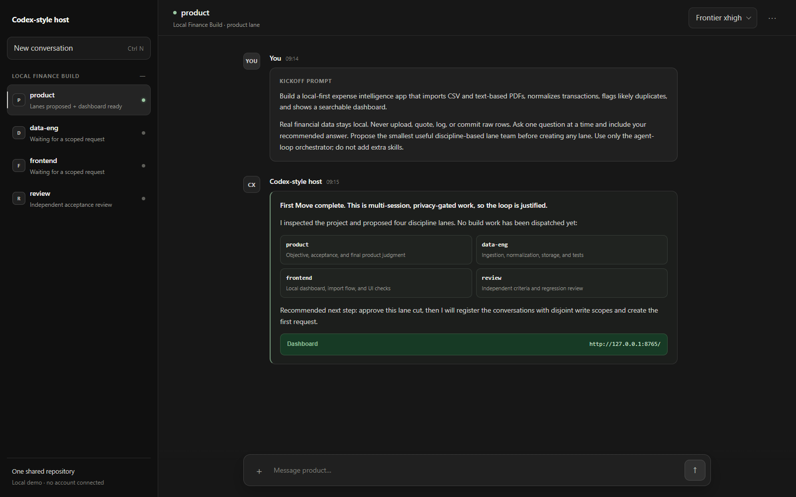

<p align="center">
  <strong>Codex Agent Loop Orchestrator</strong>
</p>

<p align="center">
  一套持久、带审查门槛的 Codex 多智能体协作方式：即使上下文丢失也能继续，并会明确告诉你什么时候需要人工介入。
</p>

<p align="center">
  
  
  
  
</p>

[English](README.md) | 简体中文

<p align="center">
  <a href="#快速开始">快速开始</a>
  |
  <a href="#截图">截图</a>
  |
  <a href="#工作原理">工作原理</a>
  |
  <a href="#安装">安装</a>
  |
  <a href="#git-模型">Git 模型</a>
  |
  <a href="#日常使用">日常使用</a>
</p>



`codex-agent-loop-orchestrator` 是一套放在仓库本地、面向长期 Codex 项目的运行协议。它为每个持续进行的 agent 任务分配具名 lane，把目标和 request 保存在文件中而不是随时可能丢失的聊天记录里，要求提供机器可读的验证证据，并让每个准备交付的工作切片都经过独立 review。

上图明确标注为通用 Codex 风格桌面端的示意图，不包含 OpenAI 或 ChatGPT 品牌标识、账户身份或真实项目数据。

## 快速开始

在项目目录中启动一个 Codex 对话，然后粘贴下面的内容：

```text
请使用 $codex-agent-loop-orchestrator 管理这个项目。

完成：<用一句话写明目标、具体交付物和可检查的完成条件>。

真实数据必须留在本地。不要上传、引用、记录、提交真实隐私数据，也不要把原始数据复制进 loop 文件或 handoff；只允许使用我批准的脱敏样本或字段结构说明。

一次只问一个 intake 问题，并附上你的推荐答案；当目标和 Done-When 已经可以检查时，立即停止提问。

创建任何对话之前，先提出满足目标所需的最小专业分工 lane 方案，确保写入范围两两不重叠，并等待我确认。

除非我明确要求，否则不要调用或添加其他 skill。

完成 First Move 后，告诉我 dashboard 的准确 URL。
```

英文启动模板见 [README.md](README.md)。

orchestrator 会先执行任务规模判断。如果工作可以在一次专注会话中完成，它应该建议直接使用单次会话，而不是搭建 loop。

## 为什么需要它

这个 skill 有条件地解决普通开发者在多智能体协作中的协调痛点。它是一层控制与审计机制——并不承诺多个 agent 会变得便宜、完全自主，或永远不会停滞。

- **知道 agent 什么时候需要你。** 本地 dashboard 会显示“Your turn”提示条，把相关 lane 移到最上方，并指出需要打开哪个对话。
- **让项目状态脱离随时可能丢失的聊天记录。** 目标、request、handoff、消息、决策和验证证据都保存在仓库中，因此换一个会话也能从文件继续。
- **减少 agent 同时踩到相同文件。** 一个 lane 对应一个持续进行的 agent 任务，并带有明确的写入范围。参考工作流要求各 lane 的范围两两不重叠，也能拒绝越界提交。
- **留下可以还原的历史。** 带 lane 标签的 commit、保存下来的消息 envelope、只追加的状态转换日志，以及逐命令证据，共同记录了什么发生了变化、为什么变化。
- **避免遗留无人接手的脏工作区。** 每个 lane 都用一次 commit 结束当前轮次；暂停 loop 时应该已经全部提交，health check 会暴露范围内残留的未提交工作。

这些能力来自[九条方法论不变量](skills/codex-agent-loop-orchestrator/references/methodology.md)，而不是 dashboard UI 本身。

## 核心亮点

- **机器检查的完成门槛。** 只有 completion checker 读到 exit code 为成功的证据时，才会输出 `SHIP_CHECK_OK`。证据缺失、格式错误或 exit code 非零都会按失败处理。这个门槛只验证记录，不会假装自己运行过测试。
- **独立 `review` lane。** 在 `product` 接受一个工作切片之前，`review` 会检查未满足的标准、范围膨胀，以及“看起来完成了，实际上是错的”这类结果。
- **面向用户工作的人工 QA 门槛。** 先完成机器检查和独立 review。随后 request 会保持在 `REVIEWING`，直到有人实际操作 UI 并确认结果。
- **真正可能变红的验收标准。** 每条标准都要指定一条在要求被破坏时能够失败的命令。面对垃圾输出仍然保持绿色的检查，不算证据。
- **先确定不变量再 intake。** 数据系统和多步骤系统先在 `goal.md` 中记录绝不能被破坏的规则，再把适用的不变量带入每个 request。
- **有边界的恢复机制。** Heartbeat、停滞 handoff 检查结果、明确的修复轮次上限和持久预算提供了恢复路径，但不会声称可以自动唤醒已经停止的对话。
- **Runtime tier 指引。** 每个 lane 都记录一个抽象 model tier，默认使用 host 可用的最高 tier，并暴露实际 tier 不匹配的情况；人可以主动把某个 lane 调低。

实现细节及其限制写在 skill 的 [Health Check](skills/codex-agent-loop-orchestrator/SKILL.md#health-check)、[Verification Integrity](skills/codex-agent-loop-orchestrator/SKILL.md#verification-integrity) 和 [Model Tier Policy](skills/codex-agent-loop-orchestrator/SKILL.md#model-tier-policy) 章节中。

## 什么时候不该用

如果任务规模小、风险低，一个 agent 在一次会话里就能完成——大致不超过两小时——而且你并不需要可审计性、handoff 恢复、敏感数据门槛或真正并行的 lane，就不要使用这套 loop。直接开一个 Codex 会话更合适。

成本确实很高。在一次相同规格、相同 host 的 `n=1` dogfood 对比中，loop 的**活跃耗时是直接会话的 7.2 倍**，**输出 token 是 10.6 倍**，**总 token 是 36 倍**。loop 的 review 抓住了单 agent 版本已经交付的正确性缺陷，但一次对比并不是普适基准。这套协议买到的是可追溯性和独立验证；它不会让多智能体协作变得免费。

如果工作没有任何有意义、可由机器检查的验收面，或者你需要全自动的多线程执行，但 host 无法创建长期对话或向其投递消息，这套 loop 同样不合适。对于重复性操作，更好的做法是用一次 loop 构建可复用工具，而不是长期维持一组 agent 在线。

## 截图

这些浅色主题图片来自真实的本地 dashboard，读取的是一份已归档的 loop 状态。公开截图已隐去本地样本路径、账户/用量身份和 conversation ID。README 顶部的深色图片是 host UI 示意图；其 HTML 源文件保存在 [`assets/mock-codex-ui.html`](assets/mock-codex-ui.html)。

### “Your turn”提示条


### Lane 卡片


### 进度


<details>
<summary>展开完整 dashboard 总览</summary>


</details>

## 工作原理

### 1. 用 lane 拆分长期职责

默认团队由 `product`、一个 build lane 和 `review` 组成。只有当 `data-eng`、`frontend`、`security` 或其他 specialist 拥有持续性职责，而且其输入、输出、路由和不重叠的写入范围都很清楚时，才应该添加它。Lane 表示专业分工，不代表人格或产品功能。

`product` 负责 `docs/loop/**` 下的 loop ledger。各 build lane 分别负责独立的代码和测试子树。每个 lane 还负责自己的 `docs/loop/lanes/<lane>/**` worklog 区域。

### 2. request 进入持久生命周期

`requests.md` 是队列和恢复索引。在一个 blocker 修复周期内复用同一个 `request_id`，同时递增 `iteration`：

```text
PLANNED -> REQUESTED -> IMPLEMENTING -> IMPLEMENTATION_DONE
        -> REVIEWING -> FIX_REQUESTED -> ACCEPTED | BLOCKED
```

跨对话投递前，typed message 会先保存在 `docs/loop/messages/<request_id>/`。如果无法投递到 thread，原子化文件 inbox 可以保住消息——但文件 inbox 并不是自动 worker。

### 3. 由机器检查完成状态

implementation lane 会运行每条验收命令，并写入一条扁平证据记录，其中包含 request、checkpoint、command、exit code 和 timestamp。`completion_gate.py` 读取这些记录。无法验证就意味着 `BLOCKED`，绝不允许“带着保留意见接受”。

### 4. 独立 review

`review` lane 检查 request 声明的标准和范围，而不是实现者的意图。Blocker 会使用同一个 request ID 返回给负责它的 build lane。Should-fix 和 nit 问题可以记录下来，不必强制进入无休止的修复循环。

### 5. 面向用户的工作等待人工 QA

机器证据和 review 通过后，UI request 仍然保持在 `REVIEWING`。`product` 会发送一个 URL 和简短的试用说明；只有明确的 `human_qa: confirmed` 记录才能解锁 `ACCEPTED`。

### 6. dashboard 把人的注意力引到正确位置

dashboard 是仓库文件和只读 health check 之上的本地查看器。它会显示 Progress、当前人工门槛、lane 归属、request、证据、Git/hook 健康状况、用量可用性和运行日志。在提示条指出去哪里操作之前，人始终留在 product 对话中。

## 安装

### 让 Codex 从仓库 URL 安装

打开一个新文件夹，在里面启动一个 Codex 对话，然后原样粘贴下面这段话：

```text
请把 https://github.com/hanco1/multi-loops-agents 中的 Codex skill 安装到我的个人 Codex skills 目录。请将仓库克隆到这个新文件夹，运行适合我操作系统的仓库安装脚本（Windows 使用 install.ps1，macOS/Linux 使用 install.sh），确认 codex-agent-loop-orchestrator 已出现在我的 Codex skills 目录下，并提醒我打开新的 Codex 会话，让 Codex 重新发现这个 skill。不要修改或 push 克隆下来的仓库。
```

### 自行运行安装脚本

两个脚本都会相对于仓库根目录定位 `skills/codex-agent-loop-orchestrator`，并替换现有安装副本，因此重新运行安装脚本即可干净地刷新它。

Windows PowerShell：

```powershell
git clone https://github.com/hanco1/multi-loops-agents.git
cd .\multi-loops-agents
.\install.ps1
```

如果本地脚本执行被阻止：

```powershell
powershell -ExecutionPolicy Bypass -File .\install.ps1
```

macOS 或 Linux：

```bash
git clone https://github.com/hanco1/multi-loops-agents.git
cd multi-loops-agents
chmod +x install.sh
./install.sh
```

默认安装位置：

- Windows：`%USERPROFILE%\.codex\skills\codex-agent-loop-orchestrator`
- macOS/Linux：`~/.codex/skills/codex-agent-loop-orchestrator`

PowerShell 使用 `-SkillsDir <path>`，bash 使用 `CODEX_SKILLS_DIR=<path>`，即可覆盖默认安装位置。安装后请打开新的 Codex 会话。

<details>
<summary>可选：安装为 Codex plugin marketplace 条目</summary>

```bash
codex plugin marketplace add hanco1/multi-loops-agents
codex plugin add codex-agent-loop-orchestrator@multi-loops-agents
```

plugin manifest 位于 [`.codex-plugin/plugin.json`](.codex-plugin/plugin.json)，marketplace manifest 位于 [`.agents/plugins/marketplace.json`](.agents/plugins/marketplace.json)。

</details>

## Git 模型

参考工作流使用**一个共享 branch，并保持线性、带 lane 标签的 commit 历史**。这是工作流约定，不是由脚本强制执行的 branch 限制。

- **每一轮都以 lane 身份提交。** 一个 lane 完成自己的工作切片后，更新 worklog 和持久 request 状态，然后在回复或 handoff 前 commit。
- **启用 scope guard。** `install_precommit.py` 会安装 Git pre-commit 检查。guard 启用后，缺少 `CODEX_LANE` 会按失败处理；暂存文件落在该 lane 声明范围之外时，也会拒绝提交。
- **保持写入范围互不重叠。** 静态 lane 范围必须两两不重叠；dynamic file lease 用于有边界的例外情况。guard 在 commit 时生效，因此无法阻止两个 process 在 commit 前同时编辑同一个文件。
- **只在干净 checkpoint 上暂停。** loop 暂停时应该已经全部提交。`product` 会检查 `git status --porcelain`，health check 会报告能够归属到具体 lane 的范围内残留工作。
- **只把私有 remote 当作备份。** 私有 remote 可以保存 checkpoint commit，并支持灾难恢复。它不是 lane 消息总线；敏感数据或原始数据也绝不能仅仅因为 remote 是私有的就被提交。

commit 身份示例：

```bash
CODEX_LANE=frontend git commit -m "frontend: finish request REQ-004"
```

PowerShell：

```powershell
$env:CODEX_LANE = 'frontend'
git commit -m 'frontend: finish request REQ-004'
```

### 为什么不让每个 lane 使用一个 Git worktree？

这个参考实现依赖所有 lane 立即看到相同的 request ledger、证据和状态转换日志。它会在写入范围冲突时主动串行化写操作，而且不实现 branch 创建、merge、rebase 或跨 worktree 状态协调。为每个 lane 分配 worktree 会增加第二套协调系统，也可能让某个 lane 根据过期 ledger 行动。如果选择 worktree，你实际上是在设计另一种实现，需要明确的 merge/协调协议；参考 scope guard 不提供这种协议。

## 日常使用

日常工作始终留在长期运行的 **product conversation**，并保持 dashboard 打开。`product` 是新工作、验收变更和最终产品判断的持久入口。

如果要改 UI，请在**同一个对话**中向 product 提出：

```text
请收紧 dashboard header 的间距，并改善 primary button 的层级。通过现有 frontend lane 和标准 review + human-QA 门槛完成这项工作。
```

不要为每次改动临时新开对话，也不要要求 `frontend` 绕过 product。直接向 lane 提出的 request 会被送回标准 request 生命周期；它绝不是绕开证据或 review 的捷径。只有已注册的 lane 对话确实过期或丢失时，才创建替代对话，然后把替代对话接入现有 lane row。

## 仓库结构

```text
multi-loops-agents/
├── .agents/plugins/marketplace.json
├── .codex-plugin/plugin.json
├── assets/
│   ├── dashboard-overview.png
│   ├── dashboard-your-turn.png
│   ├── dashboard-lane-card.png
│   ├── dashboard-progress.png
│   ├── mock-codex-ui.html
│   └── mock-codex-ui.png
├── skills/codex-agent-loop-orchestrator/
│   ├── SKILL.md
│   ├── references/
│   └── scripts/
├── install.ps1
├── install.sh
├── LICENSE
├── README.zh-CN.md
└── README.md
```

## 许可证

MIT。参见 [LICENSE](LICENSE)。
